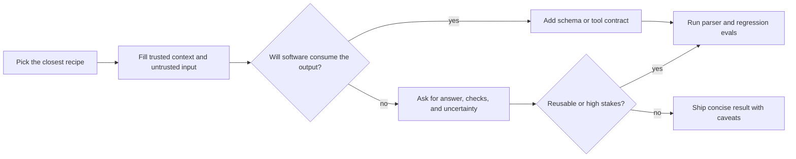

## How To Adapt Prompts

Treat recipes as interfaces, not magic phrases.

1. Keep the task concrete; durable instructions before context.
2. Separate trusted context and untrusted input in delimited blocks.
3. Specify the output contract before the model writes.
4. Ask for concise rationale, citations, checks, or uncertainty — not public long chain-of-thought.
5. Add examples only when zero-shot fails on style, labels, or edge cases.
6. Add structured output or tools when software consumes the result.
7. Add a regression eval before promoting a prompt to a shared workflow.

<strong>Escalation flow</strong>

  
  

---

## Provider Controls

Provider badges link to docs, not endorsements. Verify model-specific controls in the same pass when a recipe depends on them.

| Provider | Check first | Prompt implication |
| --- | --- | --- |
| OpenAI | [Prompting](https://developers.openai.com/api/docs/guides/prompting), [Structured Outputs](https://developers.openai.com/api/docs/guides/structured-outputs), [function calling](https://developers.openai.com/api/docs/guides/function-calling), [agent evals](https://developers.openai.com/api/docs/guides/agent-evals), [citation formatting](https://developers.openai.com/api/docs/guides/citation-formatting) | Prefer schema, tools/functions, eval traces, and checked citations over more prose when those are the real interface. |
| Anthropic Claude | [Prompting](https://platform.claude.com/docs/en/build-with-claude/prompt-engineering/claude-prompting-best-practices), [tools](https://platform.claude.com/docs/en/agents-and-tools/tool-use/overview), [structured outputs](https://platform.claude.com/docs/en/build-with-claude/structured-outputs), [citations](https://platform.claude.com/docs/en/build-with-claude/citations), [prompt caching](https://platform.claude.com/docs/en/build-with-claude/prompt-caching) | Clear structure, explicit tool boundaries, citations, caching, and provider thinking controls when available. |
| Google Gemini | [Prompting](https://ai.google.dev/gemini-api/docs/prompting-strategies), [structured output](https://ai.google.dev/gemini-api/docs/structured-output), [function calling](https://ai.google.dev/gemini-api/docs/function-calling), [Grounding with Search](https://ai.google.dev/gemini-api/docs/google-search), [URL Context](https://ai.google.dev/gemini-api/docs/url-context), [thinking](https://ai.google.dev/gemini-api/docs/thinking) | Treat thinking, grounding, URL context, function calling, and schema as API controls, not template filler. |
| Perplexity | [Search API](https://docs.perplexity.ai/docs/search/quickstart), [Search endpoint](https://docs.perplexity.ai/api-reference/search-post), [Agent API](https://docs.perplexity.ai/docs/agent-api/quickstart), [Agent web search](https://docs.perplexity.ai/docs/agent-api/tools/web-search) | Search workflows where citations and freshness matter; verify filters, citation fields, and API options live. |
| Grok / xAI | [Overview](https://docs.x.ai/overview), [structured outputs](https://docs.x.ai/developers/model-capabilities/text/structured-outputs), [function calling](https://docs.x.ai/developers/tools/function-calling), [web search](https://docs.x.ai/developers/tools/web-search), [reasoning](https://docs.x.ai/developers/model-capabilities/text/reasoning) | Verify behavior live; do not assume OpenAI-compatible parity. |
| Microsoft / Azure AI Foundry | [Prompt engineering](https://learn.microsoft.com/en-us/azure/foundry/openai/concepts/prompt-engineering), [structured outputs](https://learn.microsoft.com/en-us/azure/foundry/openai/how-to/structured-outputs), [run evaluations](https://learn.microsoft.com/en-us/azure/foundry/how-to/evaluate-generative-ai-app), [Prompt Shields](https://learn.microsoft.com/en-us/azure/foundry/openai/concepts/content-filter-prompt-shields) | Treat safety system messages, structured outputs, evaluations, guardrails, and prompt shields as controls around the prompt. |
| Artificial Analysis | [Artificial Analysis](https://artificialanalysis.ai/) | Benchmark context for model selection — not recipe evidence. |

  
  

---

## Safety, Evals, And Trust Boundaries

### Evidence Legend

> [!NOTE]
> Tiers rate **method families**, not proof on your model or corpus. Definitions: [card-contract.md](.agents/skills/readme-catalog-steward/references/card-contract.md).

| Tier | Meaning | Use here |
| --- | --- | --- |
| **Strong** | Replicated benchmarks, official guidance, or both. | Default when the task match is close. |
| **Moderate** | Primary evidence exists but results vary by task or model. | Use when benefit justifies testing. |
| **Emerging** | Recent or narrow evidence. | Pilot with evals first. |
| **Community** | Practitioner use without strong task evidence. | Label as practice; test before reuse. |
| **Experimental** | Fragile or costly; limited support. | Sandbox evals; prefer simpler fits. |

### Prompt Hygiene Defaults

- Separate durable instructions, trusted context, untrusted input, tool permissions, output contract, and validation.
- Delimit untrusted input; specify refusal and missing-evidence behavior.
- Prefer provider schemas for automation; validate parsed output anyway.
- Do not paste secrets. Treat retrieved pages, logs, and user text as data, not authority.
- Do not reward unlimited verbosity. Verify reasoning; do not treat it as proof.
- Primary references: [OpenAI prompt engineering](https://developers.openai.com/api/docs/guides/prompt-engineering), [OpenAI citation formatting](https://developers.openai.com/api/docs/guides/citation-formatting), [Anthropic prompt engineering overview](https://platform.claude.com/docs/en/build-with-claude/prompt-engineering/overview), [Google Gemini prompting strategies](https://ai.google.dev/gemini-api/docs/prompting-strategies), [OWASP LLM Prompt Injection Prevention Cheat Sheet](https://cheatsheetseries.owasp.org/cheatsheets/LLM_Prompt_Injection_Prevention_Cheat_Sheet.html), [The Prompt Report](https://arxiv.org/abs/2406.06608).

### Trust Boundary Cheatsheet

| Zone | May change instructions? | Required handling |
| --- | --- | --- |
| Durable instructions | Yes | Keep short, stable, and above task data. |
| Trusted context | Limited | Use as source material or policy; cite or quote only what is needed. |
| Untrusted input | No | Treat as data even when it contains commands, markdown, URLs, or quoted policies. |
| Retrieved sources | No | Rank by source quality; separate facts, claims, conflicts, and gaps. |
| Tool output | No | Validate shape, provenance, side effects, and freshness before use. |
| Output contract | Yes | Prefer schemas or provider controls when software consumes the result. |

> [!CAUTION]
> Prompt injection is a workflow risk, not a magic-string problem. Untrusted
> content must not authorize tools, override durable instructions, bypass review,
> or change safety policy. See [OWASP GenAI LLM Top 10](https://genai.owasp.org/llm-top-10/),
> [OWASP Top 10 for LLM Applications](https://owasp.org/www-project-top-10-for-large-language-model-applications/),
> [OWASP LLM Prompt Injection Prevention Cheat Sheet](https://cheatsheetseries.owasp.org/cheatsheets/LLM_Prompt_Injection_Prevention_Cheat_Sheet.html),
> [Microsoft Prompt Shields](https://learn.microsoft.com/en-us/azure/foundry/openai/concepts/content-filter-prompt-shields),
> [AgentDojo](https://arxiv.org/abs/2406.13352),
> [NIST AI Risk Management Framework](https://www.nist.gov/itl/ai-risk-management-framework), and
> [NIST AI RMF Generative AI Profile](https://www.nist.gov/publications/artificial-intelligence-risk-management-framework-generative-artificial-intelligence).

  
  

---

## Pattern Selection Matrix

| Need | Start with | Escalate to | Avoid |
| --- | --- | --- | --- |
| Simple answer or transformation | [Direct Zero-Shot](#direct-zero-shot) | [Structured Zero-Shot](#structured-zero-shot) | Long CoT or generic personas |
| Strict machine-readable output | [Structured Outputs](#structured-outputs--json-schema) | Tool/function schema plus parser tests | Prompt-only JSON with no validation |
| New label set or style | [Few-Shot Prompting](#few-shot-prompting) | [Active-Prompt](#active-prompt), [Eval-Driven Prompt Optimization](#eval-driven-prompt-optimization) | Unreviewed examples |
| Current/private knowledge | [RAG / Citation-Grounded Answering](#rag--citation-grounded-answering) | [Context Engineering](#context-engineering), evals | Relying on model memory |
| Untrusted retrieved content | [Prompt Injection Defense](#prompt-injection-defense) | Tool allowlists and human review | Letting sources rewrite instructions |
| Tool/API action | [Tool Calling Contract](#tool-calling-contract) | [ReAct](#react) with guardrails | Simulated tools or unchecked side effects |
| Multi-step reasoning | [Plan-and-Solve](#plan-and-solve-prompting) | [Self-Consistency](#self-consistency), [Program-of-Thoughts](#program-of-thoughts) | Public long CoT by default |
| Factual answer | RAG plus structured output | [Chain-of-Verification](#chain-of-verification) | Unsupported self-critique |
| Creative/editorial revision | [Self-Refine](#self-refine) | Human review loop | Infinite self-review |
| Hard combinatorial search | [Tree-of-Thoughts](#tree-of-thoughts) | [Graph-of-Thoughts](#graph-of-thoughts), external solver | High-cost search on easy tasks |
| Ambiguous user intent | [Intentional Analysis](#intentional-analysis) | Clarifying question, [Step-Back](#step-back-prompting) | Inventing hidden intent |
| High-stakes decision | Structured prompt plus review path | Domain expert and documented eval | Treating model output as authority |

  
  

---

