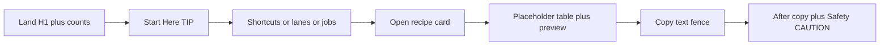
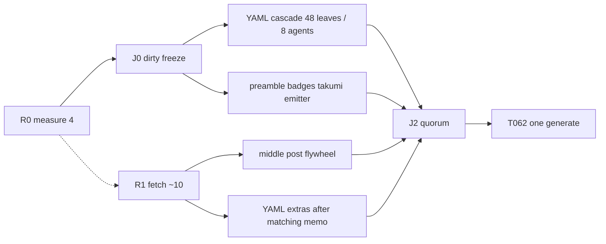

# README as generated GitHub catalog product

**Date:** 2026-08-16
**Repo:** `/Users/ww/dev/projects/prompts`
**Mode:** plan only until explicit approval. Do not regenerate, commit, or mutate `README.md` until then.

**Plan revision:** v3 (2026-08-16) — logical 48-leaf DAG + physical 8-class pool, C14 keep `## Table of Contents`, T024 contrast SSOT, apply queue, Takumi `takumi-js@2.9.2`. Critique: [critique.md](critique.md). Findings: [research/v3-findings.md](research/v3-findings.md). Schedule: [task-graph.md](task-graph.md). Leaves: [leaves.md](leaves.md). Apply: [apply-queue.md](apply-queue.md). Prompts: [fleet-prompts.md](fleet-prompts.md). Takumi: [research/takumi-readme-chrome.md](research/takumi-readme-chrome.md).

Supporting artifacts: [outline.md](outline.md), [fields.md](fields.md), [audit.md](audit.md), [research/](research/).

---

## 1. Verdict

This README is already a real **copy-first catalog**, not an awesome-list: 48 job cards with placeholder tables, hoisted previews, `text` fences, and collapsed After-copy metadata; 43 pattern notes with evidence tiers, cost, failure modes, and caveats; generated ShieldCN lanes/chips/shortcuts; a visible injection `CAUTION`; a provider-control table that prefers API interfaces over incantations. Prior research waves closed the high-value PE/control/eval set. Cardinality 48/43 is a **contract**, not a backlog.

“Ultimate” here means a better **scan → pick → fill → copy → verify** path **on github.com**, with truthful sources — not a Vite restyle and not a prettier blob of hand-edited Markdown.

Highest-leverage gaps (ranked):

1. **Fold/IA density** — ~261 lines of badge wall + three indexes before the first card; 56 TOC/Top clones.
2. **Light-theme contrast** — always-`mode=dark` ShieldCN; `#f8fafc` on `#67E8F9` / `#EAB308` fails WCAG 1.4.3.
3. **Trust freshness** — OpenAI Evals shutting down (read-only 2026-10-31, gone 2026-11-30); OWASP 2026 vs archive owasp.org; Fable news unlabeled as a suspension letter.
4. **Copy-path inversion** — Fill/`none` and Safety/eval live inside After-copy `<details>` while the fence is above.
5. **Pipeline dual-maintenance** — dirty tree; untracked `catalog_readme.mjs` is the WT compile SSOT; preamble baked badge URLs diverge from YAML until generate overwrites markers; Prompt Index is hand-authored.

---

## 2. Jobs-to-be-done (≤8)

Synonyms (improve/prettify/beautify/stylize) collapse into these jobs:

| Rank | Job | What “done” looks like |
| --- | --- | --- |
| 1 | Time-to-first-copy | Start Here + shortcuts visible immediately; first recipe much closer than line 274 |
| 2 | Scan IA | One 48-link index (Prompt Index); GitHub Outline owns heading TOC; Job Map stays generated-but-collapsed |
| 3 | GFM chrome that survives | Alerts, `kbd` as labels, ShieldCN with readable contrast; no web-only CSS |
| 4 | Copy-path fidelity | Table → preview → fence; canonical `none` pointer visible before copy; no filled-example walkthroughs |
| 5 | Source freshness | Shell + touched cards say `as verified on <date>` / `current docs say`; Evals/OWASP/Fable honest |
| 6 | Safety visibility | Section `CAUTION` stays outside `<details>`; agents-lane cards hoist one safety line above the fence |
| 7 | Generator/drift | Marker interiors owned by postprocessor; Prompt Index linted against `index.yaml`; no per-card TOC/Top |
| 8 | A11y | No color-only meaning; heading `alt=""` + visible title; pale chips get dark logo/label |

---

## 3. North star + non-goals

**North star:** A github.com visitor picks a job from Start Here, fills the table (optional zones = `none`), copies one `text` fence, and knows how to verify — in under 30 seconds for a shortcut job.

**Non-goals**

- No `web/` redesign (DESIGN.md tokens stay web-only). Takumi is README chrome only — not `web/` OG, not a runtime ImageResponse server.
- No fake license/package/release/coverage/download badges. No Takumi “fake badges” competing with ShieldCN.
- No 91-card rewrite; no new recipe/pattern unless the strict gate passes (it does **not**).
- No 48 per-recipe Takumi screenshots; no GIF/APNG heroes; no baking **48/43** into images (counts stay generated ShieldCN).
- No blog-only Strong evidence; no invented citations/models/benchmarks.
- No visible long chain-of-thought defaults.
- No Filled-example walkthroughs.
- No low-level `catalog generate readme --check`.
- Do not bulk-fake `sources.yaml` live marks.
- Do not clean or stage unrelated dirty work (`web/**`, other goals, etc.).

**DESIGN.md vs GFM:** DESIGN.md (command palette, DM Sans, Tailwind, related-hub) does **not** apply. README wins. Shared contract is only: scan-first, quiet trust, lane taxonomy names/colors as data in `catalog/index.yaml` — rendered through ShieldCN, not CSS variables.

**Defaults (not blocking questions)**

- Keep Prompt Index (48 links) — GitHub Outline may omit HTML `<h4>` recipe titles. Collapse it by default.
- Keep `### Section Map` (21 links) so `check_readme_recipes.py` still passes; collapse it.
- Keep `JOB-MAP` markers (generator requires them); leave collapsed (already).
- W2 contrast-first (darker `logoColor` on pale fills). Adaptive `<picture>` only if light mode still fails after that (it doubles URL strings).
- Keep Fill line inside After copy (checker). Add a **visible** one-line `none` reminder immediately above each fence in W6 if W4 still shows copy-without-fill; W1 only strengthens the Start Here TIP.

---

## 4. Current-state audit

See [audit.md](audit.md). Summary: P0 = A1 dirty/compile SSOT, A2 marker drift, A5 contrast, A9 Evals sunset, A10 OWASP 2026. P1 = IA duplicates, nav clones, late CAUTION, collapsed card safety, generic `upgrade_when`, hero color spans.

---

## 5. Target information architecture



**First-copy path (<30s):** H1 → Start Here TIP (`none`) → shortcut chip → card table → fence. Safety badge in the remaining compact badge row still jumps to the visible `CAUTION`.

**Collapse policy**

- Expanded: H1, compact counts/safety, 8 lanes, Start Here (shortcuts, control lanes, common jobs), Prompt Library cards, Adapt, Providers, Safety CAUTION, Pattern matrix, Pattern notes, Contributing, Bibliography.
- `<details>`: Prompt Index, Section Map, Job Map, recipe-format table, GitHub stats (after W2 split), Mermaid, After copy, Markdown quality gate.
- Never collapse: injection `CAUTION`, Adapt rule 4 (no public long CoT), agents-lane one-line safety (W4/W6).

**Before headings**

```
# Prompt Library (HTML h1 today)
## Start Here
### Recipe shortcuts / Control lanes / Common jobs
## Table of Contents
### Jump Shortcuts / Prompt Index / Section Map
## Prompt Library
### Research … Reasoning
## How To Adapt … Provider Controls … Safety … Pattern Selection Matrix
## Pattern Notes … Contributing … Bibliography
```

**After headings (T030)**

```
# Prompt Library
## Start Here
### Recipe shortcuts / Control lanes / Common jobs
## Table of Contents
### Prompt Index / Section Map   (inside details; headings unindented)
## Prompt Library
### Research … Reasoning
## How To Adapt … Provider Controls … Safety … Pattern Selection Matrix
## Pattern Notes … Contributing … Bibliography
```

**C14:** Keep `## Table of Contents`. Checkers use `find_subsection(..., "## Table of Contents", "### Prompt Index"|"### Section Map")`. Deleting that parent heading fails 48/21 even if the links survive.

Jump Shortcuts cease as a heading. Prompt Index + Section Map stay as exact `###` lines inside `<details>` (not indented). HTML h1 vs `## Prompt Library` duplicate is resolved (keep markdown `## Prompt Library` as the Outline entry; one visual title — **do not** keep both “Prompt Library” headings).

---

## 6. Visual / GFM system

**Allowed**

- `> [!NOTE|TIP|IMPORTANT|WARNING|CAUTION]` (not nested in `<details>`/tables; sparse).
- Markdown `##`/`###`; recipe HTML `<h4>` with **title text isomorphic to slug**.
- `<details>` for optional density.
- ShieldCN static + GitHub stats (not `/views/`, not retired star-history, not license/coverage).
- Icon-only heading badges with `alt=""` and adjacent visible title.
- `<kbd>` as a **text** label.
- ` ```text ` fences; 4-col tables; blockquote paste previews.
- One Mermaid **plus** a text list of the same steps.
- **Takumi committed PNG pairs** (hero + 3-step path, light/dark). JSX templates are repo source; github.com only sees `` / `<picture>`. Geist built-in; `devicePixelRatio: 2`; wide-short ~1280×360 (not only 1200×630 OG). Cap **≤4 files, ≤2 displayed per theme**. Alt text required; markdown Start Here remains the accessible path.

**Banned**

- Badge soup (3 hero rows + 8 lanes + 6 shortcuts + 56 nav pairs).
- Decorative Unicode as structure (diamonds may stay `aria-hidden` or go).
- Color-only meaning (`span` colors, `kbd` border as the only cue).
- CSS GitHub strips; Primer/Tailwind; `DESIGN.md` fonts.
- Mixed shields.io + ShieldCN.
- `animate=`; view counters; Adaptive **and** 112 TOC clones together.
- Invented alert types.
- Takumi JSX/CSS in GFM; animated README heroes; mixing ShieldCN with Takumi-drawn badge pills; replacing `text` fences with screenshots.

**Light/dark:** GitHub themes are light / dark / dark_dimmed / dark_high_contrast. Always-`mode=dark` SVGs are legal but fail light. W2: keep `mode=dark` plates (`labelColor=020617`) but set `logoColor`/`valueColor` to a dark ink (`020617` or `0f172a`) whenever the jewel fill is lighter than ~WCAG 3:1 vs `#f8fafc`. Do **not** fight the postprocessor by hand-editing README URLs. `#gh-*-mode-only` is omitted from current basic-syntax TOC — prefer contrast-safe single SVG first; `<picture>` Adaptive is W6-optional.

**Lane colors:** YAML `catalog/index.yaml` + recipe `badge.color` remain SSOT. `update_readme_badges.py` owns query params. Preamble marker snapshots are ignored at compile time — stop treating them as design.

---

## 7. Content enrichment policy

**Revise a card** when: live official docs contradict a control claim; evidence tier is wrong; copy-path fails the contract; safety is missing for the class.

**Add a card** only if: uncovered job + ≥2 independent primary/official sources + eval/caveat + correct field set. **Candidate adds: none** (PTC, Spotlighting, Gemini Interactions, Fable SKUs, Perplexity Agent are host controls, not new jobs).

**Demote evidence** when the method is practice-only or the platform is deprecated (Evals dashboard ≠ evaluation flywheel method).

**Refresh a URL** when HTTP moves, titles lie (latest-model → Using GPT-5.6; Fable access news = historical), or the archive page is mistaken for current (owasp.org LLM Top 10).

**Candidate revises (with sources; W3/W4/W5)**

- `evaluation-flywheel` (+ eval recipes if they name Evals as current): [OpenAI deprecations](https://developers.openai.com/api/docs/deprecations), [evaluation best practices](https://developers.openai.com/api/docs/guides/evaluation-best-practices) — method stays; platform dated.
- OWASP: treat owasp.org as archive; cite [2026/final](https://github.com/GenAI-Security-Project/GenAI-LLM-Top10/tree/main/2026/final) + PI cheat sheet; add Agentic Top 10 on agent cards — [OWASP project](https://owasp.org/www-project-top-10-for-large-language-model-applications/) announces 2026 (published Aug 4, 2026).
- Fable: pair [suspension letter](https://www.anthropic.com/news/fable-mythos-access) with [redeploying Fable 5](https://www.anthropic.com/news/redeploying-fable-5).
- Claude thinking: [adaptive thinking](https://platform.claude.com/docs/en/build-with-claude/thinking) primary; extended-thinking legacy.
- `json-extractor`: add Anthropic/Azure/xAI SO URLs already on the pattern.
- `tool-use-planner`: add [guardrails-approvals](https://developers.openai.com/api/docs/guides/agents/guardrails-approvals).
- Optional PE queue only if control notes are actually stale after a WT diff: `program-of-thoughts`, `chain-of-density-summarization`.

Do not relabel ToT/GoT/AoT as untouched; ultradeep already method-deepened them.

---

## 8. Parallel work system (v2)

v1 over-serialized independent files. v2 added file locks but still: dropped `## Table of Contents` (checker fail), Python-only contrast, YAML cascade waiting on fetches, 8 agents without 48 leaves, and no apply sequencer.

v3: **logical leaves** T100–T147 ([leaves.md](leaves.md)) owned by **8 physical class agents**; cascade starts at J0; extras wait on the matching memo; lead applies via [apply-queue.md](apply-queue.md); **one** `pnpm catalog:readme` at T062.

Full schedule: [task-graph.md](task-graph.md). Critique: [critique.md](critique.md). v3 findings: [research/v3-findings.md](research/v3-findings.md).

### Orchestration law

- Subagents **propose** patches under `goals/readme-product-sota-plan/proposals/`. Lead **applies**.
- One writer per path (see locks in the task graph). `post.md` is **one** bibliography/safety owner — do not split W3/W5 onto the same file.
- `README.md` is lead-only via `pnpm catalog:readme`. Never hand-edit marker interiors, counts, or ShieldCN URLs.
- `manifest.json` is lead-only at join T060.
- Mid-flight generate is **forbidden** except lead-only debug. Default: **one generate** at T062.
- OpenSpec: new change `readme-catalog-product` **iff** emitter, checkers, or `catalog:readme-chrome` change validation behavior. Do **not** hitch onto `openspec/changes/finish-web-redesign-seo-security`.
- Interrupt unused agents; do not claim unread findings ([orchestration.md](../../.agents/skills/readme-catalog-steward/references/orchestration.md)).

### Dependency (ranks, not slogans)



Critical path is Takumi render **or** post.md honesty, then generate — **not** 48 serial YAML edits. YAML cascade is off the critical path and **does not wait on J1**.

### Rank map (maps to old waves)

| Rank | Old wave | Parallelism | Generate? |
| --- | --- | --- | --- |
| R0 T000–T003 + J0 | W0 | 4 measure agents | **No** |
| R1 T010–T019 | (missing in v1) | ~10 fetchers overlap R0 | No |
| R2 T022 + confirm T020/T023 + T024 | (missing) | Lead minutes; specs already on disk | No |
| R3a | W1 + W2 + W6 + Takumi | preamble ∥ badges ∥ takumi T033a–d ∥ emitter T034→T036→T035 | No |
| R3b | W3 + W5 | middle ∥ post ∥ flywheel | No |
| R3c T100–T147 | W4 | 8 agents, 48 leaves; cascade at J0; extras per-memo | No |
| T060–T063 | W1 generate | Lead only after [apply-queue.md](apply-queue.md) P3 | **Once** |
| Rank 5–6 | validation | 6 review lanes then full AGENTS.md | No |

### W-Takumi (awesomeify without fighting copy-first)

Policy: [research/takumi-readme-chrome.md](research/takumi-readme-chrome.md). Engine: [Takumi llms-full.txt](https://takumi.kane.tw/llms-full.txt) as verified 2026-08-16.

**Ship:** four committed PNGs under `catalog/shell/chrome/dist/` — `hero-light.png`, `hero-dark.png`, `path-light.png`, `path-dark.png`. Pin **`takumi-js@2.9.2`** and **`@takumi-rs/core@2.9.2`** (npm, 2026-08-14). `render()` from `takumi-js` (not `ImageResponse`). Root node `width/height: 100%`. Templates in `catalog/shell/chrome/` (JSX, **not** imported by `web/`). `scripts/render_readme_chrome.mjs` + `pnpm catalog:readme-chrome` / `:check` (hash). CI prefers **hash of committed bytes** so README Quality does not require native N-API.

Embed with GitHub Docs `<picture>` + `prefers-color-scheme` (light/dark `source` + `img` fallback). T033 splits into four parallel renders after templates exist.

**Hero copy (timeless):** title Prompt Library; subtitle Research-backed recipes · copy · adapt · verify. **No 48/43 in the image.**

**Path copy:** Fill → Copy → Verify. Markdown Start Here stays the accessible equivalent.

**Ban:** GIF/APNG; 48 card images; Takumi badge pills; runtime OG for README; Google Fonts fetch; baking counts.

**Use the engine (not more files):** CSS Grid path strip, Flex hero, `<style>` + `::before` step indices, Geist 400/600/800, `tw` for spacing, `devicePixelRatio: 2`, local `renderSvg`/`debug` only. Full API map: [research/takumi-readme-chrome.md](research/takumi-readme-chrome.md).

Preamble references relative repo paths after T033. If PNGs are not yet rendered, T030 may leave a commented path or skip `` until T033 — lead stitches at J2.

### Dirty YAML protocol (C10)

J0 writes `dirty-yaml-allowlist.md`: each dirty `catalog/recipes/*.yaml` is **bake** (T062 will ship it), **revert before generate**, or **out of program**. Featured class extras only run on allowlisted files plus in-program edits.

---

## 8b. Wave goals (still the product intent)

### R0 — Measurement + drift (S)

Same as v1 W0, plus explicit dirty allowlist. Files: this goals folder only.

### R3a preamble — Start Here / TOC / scan path (M)

Same as v1 W1, plus Takumi `<picture>` after assets exist. **Keep `## Table of Contents`.** Collapse Prompt Index + Section Map under it (48/21). Single title. TIP → CAUTION + `none`. Copy shell TOC/Top URLs from T024.

### R3a badges — GFM/a11y (M)

Same as v1 W2. Fetch live ShieldCN SVG first (T016) so `logoColor` targets the real jewel.

### R3b — middle/post + flywheel (M)

Same as v1 W3+W5 but **one** `post.md` writer. `evaluation-flywheel.yaml` is a different lock (parallel with post).

### R3c — Recipe YAML (M, width-8)

Class agents own files (`RECIPE_CLASS`; `editorial` = writing lane). Shared T020 one-liners already in `upgrade-when-spec.md`. Cascade at J0 on allowlisted files. Featured extras are per-leaf in [leaves.md](leaves.md) after the matching fetch — not after all of J1. **Do not** edit `badge.color`. Agents-lane above-fence safety is T036 emitter unless YAML already can.

### R3a emitter — Generator/checkers (M)

navBadges drop is **in the first ship if T022 OpenSpec allows**. Order: T034 → T036 → T035. Keep canonical Fill in After copy; extra above-fence `none` must not use `Before you copy` / `paste zones table`. Keep `catalog generate readme --check` rejected. Update `emit-readme.test.js` J-03 if it requires per-card `#top`. Commit WT `catalog_readme.mjs` if `package.json` already points at it.

---


## 9. File-level change map

| Path | Why | Rank |
| --- | --- | --- |
| `catalog/shell/preamble.md` | Fold, collapse indexes, H1 policy, TIP, drop color spans, Takumi `` | R3a T030 |
| `catalog/shell/middle.md` | Providers, CAUTION/OWASP, Mermaid text twin | R3b T040 |
| `catalog/shell/post.md` | Bibliography + Evals/Fable/thinking (**one writer**) | R3b T041 |
| `catalog/shell/chrome/**` | Takumi templates + 4 PNGs | R3a T032–T033 |
| `scripts/render_readme_chrome.mjs` | Deterministic PNG render | T033 / T061 |
| `catalog/shell/manifest.json` | SHA-256 after every shell edit | **Lead T060** |
| `catalog/index.yaml` | Only if lane/shortcut/chip metadata or pale `color` must change | A-badges sequential |
| `catalog/recipes/*.yaml` | Class cascade + featured extras | R3c 8 agents |
| `catalog/patterns/evaluation-flywheel.yaml` | Evals sunset | T050 |
| `scripts/update_readme_badges.py` | Contrast params; optional row split | T031 |
| `tests/fixtures/badge_heading_urls.json` | Golden heading URLs after contrast | T031 |
| `goals/readme-product-sota-plan/contrast-params.md` | Shared logoColor/valueColor SSOT (T024) | R2 |
| `packages/catalog-core/src/emit-readme.js` | navBadges; optional above-fence line | T034–T036 |
| `scripts/check_readme_recipes.py` | Only if Fill location or Section Map wrapping breaks | T035–T036 |
| `scripts/catalog_readme.mjs` | WT publisher; commit if package.json already points here | T061/T091 |
| `package.json` / lockfile | `takumi-js` + `catalog:readme-chrome` | Lead T061 |
| `openspec/changes/readme-catalog-product/` | Iff emitter/checkers/chrome target | T022/T055 |
| `README.md` | **Generated only** via `pnpm catalog:readme` | T062 |
| `source-refresh.md` | Only rows actually re-fetched | T040/T041 |
| `.nx/version-plans/YYYY-MM-DD-*.md` | If user-visible README product ships | T090 |

**Do not touch:** `web/**`, `DESIGN.md` (except reading thesis), CI workflows unless T061 hash-check is a one-line job addition (prefer local hash in existing README Quality over native Takumi), skill files (except optional P2 `badge-surfaces.md` alt example), `sources.yaml` unless a URL actually changes, unrelated `goals/**` except this folder.

---

## 10. Risk register

| Risk | Mitigation |
| --- | --- |
| Dirty tree (`web/**`, many recipes, AGENTS.md, untracked publisher) | W0 inventory; stage only README-product paths; never `git add -A` |
| `pnpm catalog:readme` rewrites README **and** bakes dirty YAML | W0 callout; W1 operator confirms YAML is acceptable |
| 48/21 anchor breakage | Keep `## Table of Contents` plus unindented `### Prompt Index` / `### Section Map` and all links; collapse only |
| Camo/ShieldCN flakes | `pnpm run badges:urls`; no `/views/`; cache 1h on stats |
| GitHub HTML subset strips `style`/`id` | Do not rely on color; keep title↔slug isomorphic so Outline/slugify still works |
| Over-collapsing safety | CAUTION stays expanded; agents-lane one-liner |
| Dual shell vs README | Never hand-edit marker interiors or counts |
| Adaptive doubling URLs | Contrast-first; Adaptive only after nav clone cut |
| Alerts inside details | Do not wrap `CAUTION`/`TIP` in `<details>` |
| CI / `badges:urls` | Bound probe already in README Quality |
| Same-file clobber (`post.md`, emitter, manifest) | Locks in [task-graph.md](task-graph.md); lead-only join |
| Native Takumi N-API flakes in CI | Commit PNGs; `:check` is hash compare; do not require render on every README Quality job |
| Hero bakes 48/43 | T023 copy freeze: timeless subtitle |
| Extra Camo from 4 PNGs | Cap 4 files; they do **not** count toward 500 KiB markdown; still count as requests |
| OpenSpec skipped for checker change | T022 gate before T034 |
| T017 Outline `[uncertain]` | Keep collapsed Prompt Index |
| T016 jewel ≠ fill | Do not guess `logoColor` |

---

## 11. Open questions (blocking only)

None that block **R0 + R3a preamble**. Defaults: committed Takumi PNGs (not CI-native render); contrast-first not Adaptive; keep 48/21 collapsed indexes; one generate at T062.

Non-blocking: Adaptive vs contrast-only after T031; whether navBadges drop rides the first ship (default **yes** if OpenSpec is cheap); commit untracked `catalog_readme.mjs` with chrome (default: yes if package.json already points at it).

---

## 12. Done definition

**User-visible**

- Shortcut copy in <30s on github.com light **and** dark (chips readable).
- One collapsed 48-link index; no badge wall before Start Here.
- Canonical `none` pointer still exact; no filled examples.
- Evals/OWASP/Fable/thinking claims match docs as verified on the implementation date.
- 48 recipes / 43 patterns unchanged unless a later gate (none planned).
- Takumi hero+path readable on github.com light **and** dark; alt text present; no counts in images.
- Unique ShieldCN down after navBadges cut (if T034 shipped).
- Unrelated dirty files unstaged.

**Validation (AGENTS.md § Validation — required after implementation; R0 skips generate):**

```bash
DOCS=(
  README.md
  AGENTS.md
  DESIGN.md
  $(git ls-files --cached --others --exclude-standard -- \
    CONTRIBUTING.md SECURITY.md CODE_OF_CONDUCT.md)
  .agents/skills/readme-catalog-steward/SKILL.md
  .agents/skills/readme-catalog-steward/references/*.md
  source-refresh.md
  $(git ls-files --cached --others --exclude-standard -- \
    'openspec/changes/**/*.md' ':(exclude)openspec/changes/archive/**')
  goals/codebase-sota-improvement/scratch/a11y-defer.md
  goals/codebase-sota-improvement/scratch/cb-closeout-residual.md
  goals/codebase-sota-improvement/scratch/residual-register.md
  goals/prompt-catalog-research-upgrade/hygiene-report.md
  goals/web-design-sota-enrich/goal.md
)
pnpm run toolchain:check
pnpm install --frozen-lockfile
pnpm catalog:validate
pnpm catalog:test
pnpm catalog:readme:check
python3 scripts/check_readme_recipes.py --readme README.md --check
python3 scripts/audit_paste_zone_cells.py --check --strict-warn
python3 -m unittest discover -s tests -v
python3 scripts/check_sources_manifest.py --check
pnpm exec markdownlint-cli2 "${DOCS[@]}"
pnpm run docs:links
python3 scripts/update_readme_badges.py --check
pnpm run badges:urls
# … remainder of AGENTS.md § Validation unchanged (py_compile, JSON/YAML, CI pins,
#    openspec, actionlint, lint, format, site-data, web tests, git diff --check)
```

W1 local bar: `pnpm catalog:test && pnpm catalog:readme && pnpm catalog:readme:check && python3 scripts/check_readme_recipes.py --readme README.md --check && python3 scripts/update_readme_badges.py --check` plus `pnpm catalog:readme-chrome:check` when chrome exists. Full block before calling the program done.

---

## Implementation prompts (fleet)

Canonical copy-paste prompts: [fleet-prompts.md](fleet-prompts.md). Sequencer: [apply-queue.md](apply-queue.md). Leaves: [leaves.md](leaves.md).

Pin subagents to Extra High. Lead runs R0, writes J0, then dispatches with context packs (do not load the full README into YAML agents).

### Lead — Rank 0 only

```text
Implement Rank 0 only of goals/readme-product-sota-plan/plan.md and
task-graph.md in /Users/ww/dev/projects/prompts. Do not generate README.
Do not edit catalog YAML, shell, or web/. Launch T000–T003 in parallel.
Write dirty-yaml-allowlist.md (J0). Keep ## Table of Contents in any later
preamble work (C14). Do not commit.
```

Full-program prompt is in fleet-prompts.md (Lead — J0 then dispatch).

